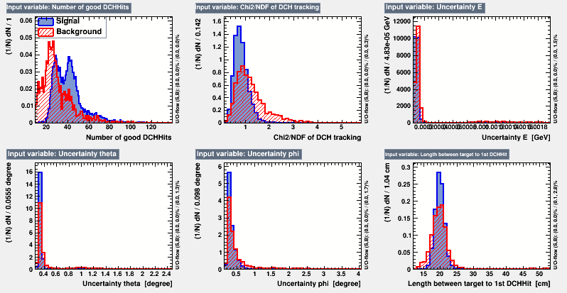
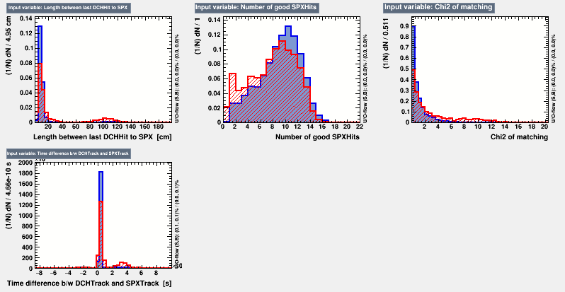
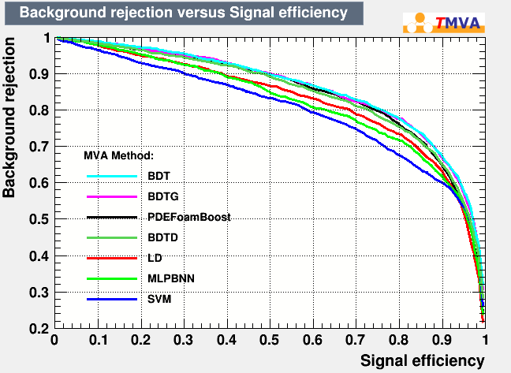
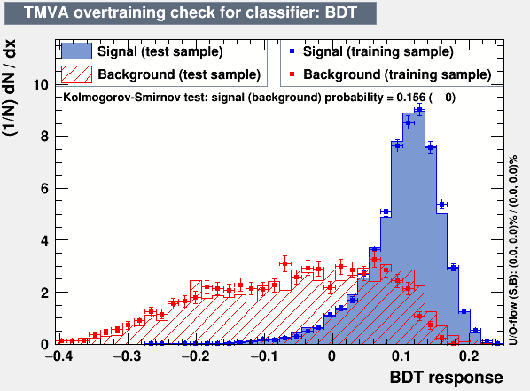
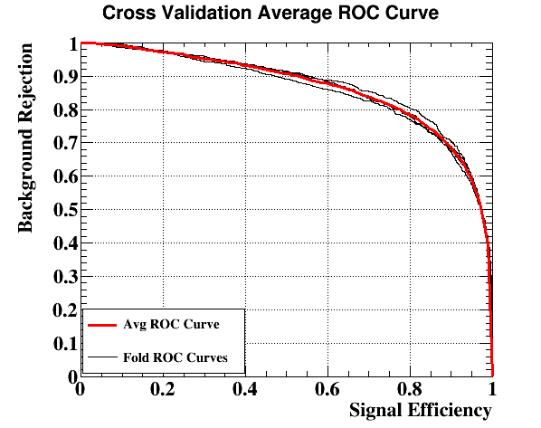

# TrackQualityQuantification_TMVA
Quantify track quality with TMVA 

Author: Yusuke Uchiyama


### Environment ###
* ROOT 6.20.00
   * TMVA
   * ROOT interpreter (CLING)

## Procedure ##
1. Make dataset files with `TrackQualityQuantificationDataset.cpp`. Move `TrackQualityQuantificationInput.root` here.
2. Train models, evaluate the performance, tune hyper-parameters, and select a model 
   with `TrackQualityQuantificationClassifier.cpp`
    or `TrackQualityQuantificationCrossValidation.cpp`.
3. Apply the model to data. An example is `TrackQualityQuantificationApplication.cpp`.

```console
$ cd $MEG2SYS/analyzer
$ ./meganalyzer -I path/to/track_qualification_TMVA/TrackQualityQuantificationDataset.cpp
or
$ ./meganalyzer -I '../../track_qualification_TMVA/TrackQualityQuantificationDataset.cpp+'
```

```console
$ root  ./TrackQualityQuantificationClassification.cpp | tee TrackQualityQuantificationClassification.log
or
$ root './TrackQualityQuantificationClassification.cpp("BDT")' | tee TrackQualityQuantificationClassification.log
```

```console
$ root './TrackQualityQuantificationApplication.cpp("BDT")'
```


## Input variables ##

* `ngoodhits`: The number of good hits used in CDCH track fit.
* `redChi2`: The reduced chisquare of the CDCH track fit.
* `EPositronUncert`: The uncertainty on EPositron evaluated from the covariance matrix of the CDCH track fit (GeV).
* `PhiPositronUncert`: The uncertainty on PhiPositron evaluated from the covariance matrix of the CDCH track fit (deg).
* `ThetaPositronUncert`: The uncertainty on ThetaPositron evaluated from the covariance matrix of the CDCH track fit (deg).
* `extrapolationLengthTarget`: The extrapolation length from the first CDCH hit to the target (cm).
* `extrapolationLengthSPX`: The extrapolation length from the last CDCH hit to the SPX (matched point) (cm).
* `nSPXHits`: The number of good hits used in SPX track fit.
* `matchingDT`: The time difference between CDCH track and SPX track (s). 
* `matchingChi2`: The chisquare of CDCH-SPX matching.




## Quantification with classification methods ##
Use classifiers to quantify the track quality.
The classifiers are trained to separate 'good track' and 'bad track'.
Note that we do not intend to distinguish them but to quantify the quality of tracks by using the output of the classifiers.

The 'good' track is defined as a track satisfying the track selection and falling into the 5-sigma window 
(in EPositron, ThetaPositron, PhiPositron, YPositron, ZPositron, and TPositron).

The 'bad' track is defined as a track satisfying a loose track selection (at least successfully propagated to both target and SPX) but not falling into the 5-sigma window.


## Notes ##

### Aug. 2020 ###
Use MC, signal e+ mixed to 7e7 Michel e+, with a sample of 40k events for training and testing.
17282 'good track' samples and 4211 'bad track' samples.


  
This is trained and tested with 50:50 samples with AdaBoost BDT.

Cross validation


```
Summary for method BDT
        Fold 0: ROC int: 0.867373, BkgEff@SigEff=0.3: 0.879
        Fold 1: ROC int: 0.873474, BkgEff@SigEff=0.3: 0.903
        Fold 2: ROC int: 0.857859, BkgEff@SigEff=0.3: 0.887
        Fold 3: ROC int: 0.866336, BkgEff@SigEff=0.3: 0.887
```
We can check the robustness of model with the cross validation.
e.g if the k ROC-curves from the k-fold cross validation show large variation, then the model
is not stable; you should choose other models.

Tried hyper-parameter tuning with TMVA::HyperParameterOptimisation class and method->OptimizeTuningParameters()
but none of them worked well.
